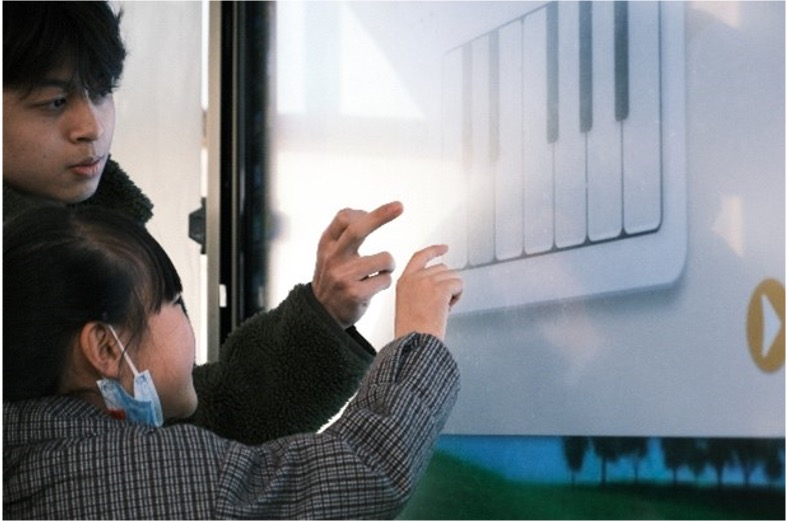

# 🎵 EveryMusic (Everyons is a musician)

Light Up Music Dreams for Rural Students

## What is EveryMusic

EveryMusic is an interactive music teaching software designed for underresourced
rural primary school students. This is a demo version, which was piloted in 6
primary schools and brought a wonderful music classroom experience to 600+ rural
primary school students

## The power of softwares
It's not about money or reputations. We care about the smiles on children's faces.

See how happy the kids are when playing with EveryMusic





## Try EveryMusic
You can experience EveryMusic via out online demo version: https://every-music-spa.vercel.app

If you are interested in our underlying technologies and designs, welcome to pull our EveryMusic to your computer.

EveryMusic is developed mostly by frontend technologies. You have to install a Node.js on your computer first 

1. install node.js: https://nodejs.org/en
2. install dependencies
```
npm install
```
3. run the dev server
```
npm run start
```

You are free to copy or modify EveryMusic as long as you are doing great things for rural students.

## Core Developers
- Puggo (Andrew): puggoo1145@gmail.com
- Nikaido-Asuka@github
- Kai Hu
